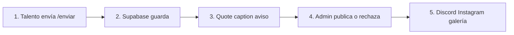
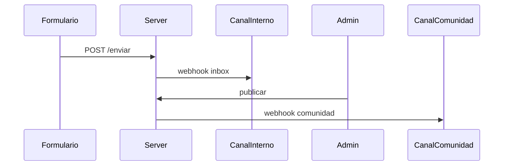
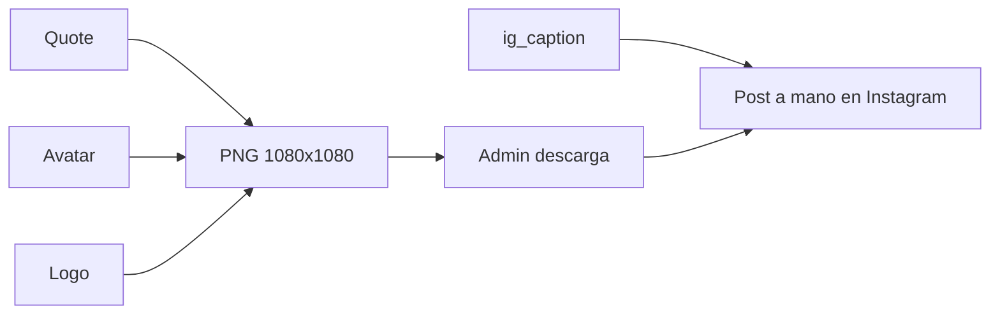

# Plan: sistema de testimonios

Brief: capturar → almacenar → validar → compartir (Discord e Instagram). Tally/Excel son referencia de campos. Formato base: **texto**. **Avatar obligatorio**. Captura del proyecto y YouTube opcionales. Se pide en **Demo Day**.

App nueva `apps/testimonios` (Next + Supabase). No se mezcla con la landing de empresas.

---

# V1 — Cómo funciona el sistema

El talento no entra al admin. El equipo **solo valida y publica**. El resto corre solo.

**V1 no procesa video.** Si hay video, es un **link de YouTube**: se guarda y se embebe. Sin grabar en el form, sin subir mp4, sin FFmpeg, sin worker, sin OpenCut.

## Cuándo se pide — Demo Day

El pedido y el recordatorio se dicen **en la Meet del demo day**. El mismo día, además, un aviso en el **canal general de Discord**.

1. **Inicio de la Meet.** Speech corto + link `/enviar` en el chat.
2. **Mismo día, Discord general.** Un mensaje en el canal general con el mismo link, para quien no está en la Meet o entra tarde.
3. **Cierre de la Meet.** Recordatorio + el mismo link otra vez en el chat.

Cadencia: cada simulación / al menos un lote al mes.

## Capturar — `/enviar`

Wizard corto, sin login.

1. Qué querés contar
2. Nombre y email
3. Historia según el tipo
4. **Avatar** (obligatorio) + **captura del proyecto** (opcional) + YouTube e Instagram (opcionales)
5. Consentimiento y enviar

**Todos**

- Qué querés contar — obligatorio
- Nombre completo — obligatorio
- Email — obligatorio (no sale en público)
- **Avatar** — **obligatorio**. Foto de la **persona** (cara / perfil). Es lo que va redondo en la card y en Discord junto al nombre. Sin avatar no se puede enviar.
- **Captura** — opcional. **No es el avatar.** Imagen del **trabajo** (demo, producto, equipo).
- Video — opcional: **solo URL de YouTube**
- Instagram — opcional, para mención en el caption
- Consentimiento — obligatorio

**Según el tipo**

- Simulación: *Contanos tu experiencia en la simulación*
- Primer empleo: empresa, puesto, *Cómo te ayudó la simulación*
- Reconversión: oficio anterior, rol nuevo, *Por qué cambiaste y cómo te está ayudando No Country*

Totales: simulación 6 obligatorios (incluye avatar); empleo y reconversión 8.

Al enviar, el sistema arma dos textos **sin IA**: recorta lo que escribió la persona.

- **Quote** (card y Discord): primeras ~200–240 caracteres o las primeras 2 oraciones, cortando en un punto o espacio.
- **Caption** de Instagram: ese quote + nombre + perfil de instagram (si esta disponible) + hashtags fijos.

El admin puede editarlos antes de publicar.

## Guardar

Supabase: una fila (`in_review`). Avatar obligatorio y captura opcional en Storage. `video_url` = YouTube. Email solo admin.

Tablas, enums y SQL: [app_testimonios_v1_db.md](app_testimonios_v1_db.md).

## Validar — `/admin`

Inbox. Preview de la card (y del embed de YouTube si hay). Publicar o rechazar. Retocar quote si hace falta.

## Publicar en Discord de comunidad (post validación)

No hay bot, ni OAuth, ni Discord Developer Portal. Son **dos Incoming Webhooks** (una URL por canal). En Discord: Editar canal → Integraciones → Webhooks → Nuevo webhook. Cada URL va a un env distinto. El de comunidad **no dispara** hasta que un admin publica.

**Setup**

No hace falta ser dueño ni “Admin” del servidor. Hace falta el permiso **Manage Webhooks** en ese canal (o que un admin te cree el webhook y te pase la URL).

1. Canal interno del equipo (privado): crear webhook → `DISCORD_INBOX_WEBHOOK_URL`.
2. Canal de comunidad (el de testimonios, no el general del Demo Day): crear webhook → `DISCORD_COMMUNITY_WEBHOOK_URL`.
3. Pegar las URLs en `.env.local` / Vercel. Si una está vacía, ese aviso no se manda; el resto de la app sigue.

El aviso del Demo Day en el canal **general** es a mano (link `/enviar`). Los webhooks son otro canal: inbox del equipo y publicación a la comunidad.

**Al enviar** (aún `in_review`): `POST` JSON al webhook interno. Aviso corto: nombre, tipo, “nuevo testimonio”, link a `/admin/{id}`. Username del webhook: algo tipo “Testimonios inbox”. La comunidad no ve nada.

**Al publicar:** el server action pasa a `published`, escribe `published_at`, y **después** hace `POST` al webhook de comunidad. El testimonio no espera a Discord para quedar publicado.

Cuerpo del `POST` (comunidad): `content` (YouTube suelto si hay, para el player) + `embeds[0]`.

Cuerpo del post (embed):

- Autor: `full_name` + avatar. El archivo **no se sube a Discord**. Se manda `embeds[0].author.icon_url` con la URL pública de Storage (`publicStorageUrl("avatars", avatar_path)`), la misma que ya usa el admin. Discord la descarga. El `avatar_url` de la raíz del webhook es el logo de No Country, no la cara del talento.
- Título: tipo (Simulación / Primer empleo / Reconversión)
- Descripción: `quote`
- Imagen grande: **captura** del proyecto, si hay
- Campos: empresa/puesto o reconversión si vienen en `payload`
- Color/footer: No Country

Si el webhook falla, el testimonio **igual queda publicado**. El admin ve “no se pudo postear en Discord” y un botón **Reintentar**.

### Cómo se usa cada media (sin galería)

Hay tres archivos. Cada canal los usa distinto porque Discord y Instagram no aceptan lo mismo.

- **Avatar** (cara / perfil, siempre hay): en Discord es el icono junto al nombre. En Instagram va en la **card generada**, no se postea solo.
- **Captura** (screenshot del proyecto, opcional): en Discord es la imagen grande del embed. En Instagram v1 **no entra** al post (la imagen del feed es la card).
- **YouTube** (URL, no un mp4 nuestro, opcional): en Discord el link va en el **texto del mensaje** para que se desarme el player. En Instagram no se puede postear como Reel (pide archivo, no link). En v1 el URL puede ir en el caption, que no es clickeable. El Reel queda para v2.

**Discord, en la práctica**

1. Siempre: nombre + avatar chico + quote.
2. Si hay captura: va de imagen grande. Si no hay, el post es solo texto + cara.
3. Si hay YouTube: se manda la URL suelta en el mensaje para que Discord muestre el video. Un embed **no** reproduce YouTube; hace falta el link en el body.
4. No se sube el video como archivo. No hace falta.

**Instagram, en la práctica (v1)**

Instagram no acepta un post de solo texto. El post es **una imagen cuadrada + un caption**. La imagen **se genera** en la app: no se sube la captura ni el avatar crudo.

La card (PNG 1080×1080) se arma con `ImageResponse` (`next/og`), mismos tokens que la app (fondo oscuro, DM Sans).

**Logo:** el chrome usa [`BrandLogo`](../../../packages/ui/src/brand-logo.tsx) (`@repo/ui`) con `/brand/logo-no-country.svg`. La card de Instagram (`next/og`) no carga bien el SVG: ahí va el PNG (`public/brand/logo-no-country.png`).

- Logo No Country
- Avatar redondo
- Quote (el que el admin retocó)
- Nombre

La captura del proyecto **no va** en esta pieza. Sigue yendo a Discord. YouTube no entra como video.

**Cómo se publica**

1. En `/admin/[id]`: preview de la card (se regenera si cambia el quote) + **Descargar imagen** + **Copiar caption**.
2. Ruta protegida tipo `/admin/[id]/ig-card` (sesión admin). No es pública mientras esté `in_review`.
3. El equipo sube el PNG y pega el caption en Instagram (app o Meta Business). Discord sí es automático; IG en v1 no.
4. Graph API queda para después: haría falta una URL pública del PNG (recién cuando está `published`).

**Lo que no se puede en v1**

- Pasar el YouTube a un Reel o a un mp4 con logo (hace falta bajar/procesar el archivo → v2).
- Que Discord “incruste” el video dentro de la imagen del embed.
- Meter la captura del proyecto en el mismo post automático de Instagram.

## Stack v1

- Next 16 en `apps/testimonios`, puerto 3001, UI propia
- Supabase: Postgres, Auth (admin), Storage (`avatars` + `captures`), RLS
- Vercel. Sin worker de video
- Env: Supabase, `DISCORD_INBOX_WEBHOOK_URL`, `DISCORD_COMMUNITY_WEBHOOK_URL`, tokens Meta si hay IG Business

## Orden de implementación (v1)

1. Scaffold de la app
2. Supabase (tabla, Storage avatares + capturas, Auth, RLS)
3. Formulario + quote/caption auto + aviso inbox
4. Admin validar / publicar
5. Galería + embed YouTube
6. Discord webhooks + card IG (descargar PNG + copiar caption)

---

# V2 — Video: qué métodos hay y cuál elegir

Objetivo de v2: marca, portada y formato (Reels 9:16 / Discord 16:9), como pedía el brief. En v1 no se construye. Se **evalúa** qué está disponible entonces y qué encaja (costo, ops, calidad, abandono del form).

## Candidatos a comparar

- **Grabar en el form** (30–60 s, como Senja) — genera archivo nuestro
- **Subir mp4** — mismo archivo, más abandono que grabar
- **Seguir solo YouTube** — embeber, sin marca automática
- **Job FFmpeg** (worker Fly/Railway o API tipo FFmpeg Micro) — logo + tamaños; hace falta archivo, no un link
- **OpenCut** — editor a mano hoy; API / headless del rewrite [aún no está para producción](https://github.com/OpenCut-app/OpenCut/issues/811)

Criterio: el que permita automatizar marca **sin** un servidor caro, y sin alargar tanto el form que lo abandonen. Si OpenCut headless ya existe en ese momento, se compara contra FFmpeg. Hasta entonces v1 no depende de ninguno.