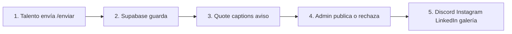
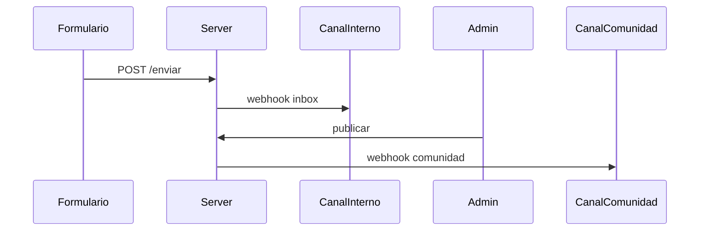
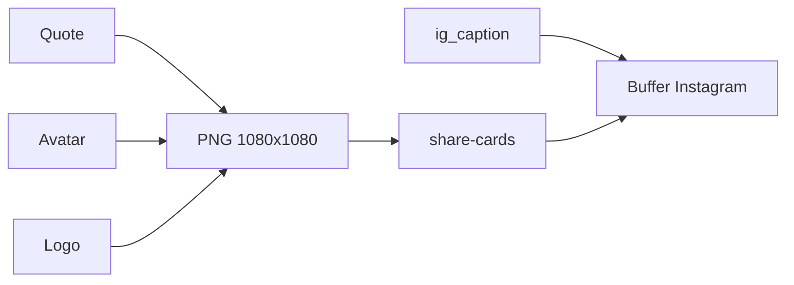

# Plan: sistema de testimonios

Brief: capturar → almacenar → validar → compartir (Discord, Instagram y LinkedIn). Tally/Excel son referencia de campos. Formato base: **texto**. **Avatar obligatorio**. Captura del proyecto y YouTube opcionales. Se pide en **Demo Day**.

App nueva `apps/testimonios` (Next + Supabase). No se mezcla con la landing de empresas.

---

# V1 — Cómo funciona el sistema




El talento no entra al admin. El equipo **solo valida y publica**. El resto corre solo.

**V1 no procesa video.** Si hay video, es un **link de YouTube**: se guarda y se embebe. Sin grabar en el form, sin subir mp4, sin FFmpeg, sin worker, sin OpenCut.

## Cuándo se pide — Demo Day

El pedido y el recordatorio se dicen **en la Meet del demo day**. El mismo día, además, un aviso en el **canal general de Discord**.

1. **Inicio de la Meet.** Speech corto + link `/enviar` en el chat.
2. **Mismo día, Discord general.** Un mensaje en el canal general con el mismo link, para quien no está en la Meet o entra tarde.
3. **Cierre de la Meet.** Recordatorio + el mismo link otra vez en el chat.

Cadencia: cada simulación / al menos un lote al mes.

## Capturar — `/enviar`

Wizard corto, sin login.

1. Qué querés contar
2. Nombre y email
3. Historia según el tipo
4. **Avatar** (obligatorio) + **captura del proyecto** (opcional) + YouTube, Instagram y LinkedIn (opcionales)
5. Consentimiento y enviar

**Todos**

- Qué querés contar — obligatorio
- Nombre completo — obligatorio
- Email — obligatorio (no sale en público)
- **Avatar** — **obligatorio**. Foto de la **persona** (cara / perfil). Es lo que va redondo en la card y en Discord junto al nombre. Sin avatar no se puede enviar.
- **Captura** — opcional. **No es el avatar.** Imagen del **trabajo** (demo, producto, equipo).
- Video — opcional: **solo URL de YouTube**
- Instagram — opcional, para mención en el caption de IG
- LinkedIn — opcional, perfil (`linkedin.com/in/…`) o handle, para el caption de LI
- Consentimiento — obligatorio

**Según el tipo**

- Simulación: *Contanos tu experiencia en la simulación*
- Primer empleo: empresa, puesto, *Cómo te ayudó la simulación*
- Reconversión: oficio anterior, rol nuevo, *Por qué cambiaste y cómo te está ayudando No Country*

Totales: simulación 6 obligatorios (incluye avatar); empleo y reconversión 8.

Al enviar, el sistema arma los textos **sin IA**: recorta lo que escribió la persona.

- **Quote** (card IG y Discord): primeras ~200–240 caracteres o las primeras 2 oraciones, cortando en un punto o espacio.
- **Captions** de Instagram y LinkedIn (misma plantilla, distinta red):

```
Desde No Country compartimos esta historia de nuestro talento

"{quote}"

{fullName}
{instagram | linkedin}

#NoCountry #DemoDay #TalentoIT
```

El admin puede editar quote y captions antes de publicar. Si cambia el quote y el caption no tiene un intro usable, se regenera la plantilla. En Instagram y LinkedIn, **Generar con IA** (Gemini) reescribe solo el intro; quote, nombre, red y hashtags los arma el código. Detalle: [COPY_PIPELINE.md](./COPY_PIPELINE.md).

## Guardar

Supabase: una fila (`in_review`). Avatar obligatorio y captura opcional en Storage. `video_url` = YouTube. Email solo admin.

Tablas, enums y SQL: [app_testimonios_v1_db.md](app_testimonios_v1_db.md).

## Validar — `/admin`

Inbox master-detail (`AdminInboxShell` en el layout protegido): lista a la izquierda, ficha a la derecha. Los estados (en revisión / publicado / rechazado) filtran la lista en el cliente; no hay `?status=` en la URL. Al elegir un envío, el detalle muestra un esqueleto (`AdminDetailLoading` / `[id]/loading.tsx`) hasta que carga `/admin/[id]`.

En la ficha: envío original arriba (desplegable), quote editable, y preview por tabs (`AdminShareTabs`: Discord por defecto / Instagram / LinkedIn). Los tres tabs usan el mismo marco full width. La card de Instagram no supera `max-w-md` adentro del tab; el caption de IG va al lado (con Generar con IA). LinkedIn edita el caption adentro del preview. Publicar, guardar borrador o rechazar. Después de publicar: Discord / Buffer se envían solos; si fallan, reintentar. Las tabs siguen para revisar o copiar.

## Publicar en Discord de comunidad (post validación)

No hay bot, ni OAuth, ni Discord Developer Portal. Son **dos Incoming Webhooks** (una URL por canal). En Discord: Editar canal → Integraciones → Webhooks → Nuevo webhook. Cada URL va a un env distinto. El de comunidad **no dispara** hasta que un admin publica.




**Setup**

No hace falta ser dueño ni “Admin” del servidor. Hace falta el permiso **Manage Webhooks** en ese canal (o que un admin te cree el webhook y te pase la URL).

1. Canal interno del equipo (privado): crear webhook → `DISCORD_INBOX_WEBHOOK_URL`.
2. Canal de comunidad (el de testimonios, no el general del Demo Day): crear webhook → `DISCORD_COMMUNITY_WEBHOOK_URL`.
3. Pegar las URLs en `.env.local` / Vercel. Si una está vacía, ese aviso no se manda; el resto de la app sigue.

El aviso del Demo Day en el canal **general** es a mano (link `/enviar`). Los webhooks son otro canal: inbox del equipo y publicación a la comunidad.

**Al enviar** (aún `in_review`): `POST` JSON al webhook interno. Aviso corto: nombre, tipo, “nuevo testimonio”, link a `/admin/{id}`. Username del webhook: algo tipo “Testimonios inbox”. La comunidad no ve nada.

**Al publicar:** el server action pasa a `published`, escribe `published_at`, y **después** postea Discord (webhook) e Instagram/LinkedIn (Buffer). El testimonio no espera a las redes para quedar publicado.

Cuerpo del `POST` (comunidad): solo `embeds[0]` (sin `content`). Username del webhook: No Country. `avatar_url` de la raíz: logo de No Country.

Cuerpo del post (embed):

- Autor: `full_name` + avatar. El archivo **no se sube a Discord**. Se manda `embeds[0].author.icon_url` con la URL pública de Storage (`publicStorageUrl("avatars", avatar_path)`), la misma que ya usa el admin. Discord la descarga.
- Título: tipo (Simulación / Primer empleo / Reconversión)
- Descripción: intro fijo de No Country + quote entre comillas (`buildDiscordDescription`)
- Imagen grande: **captura** del proyecto, si hay
- Campos: empresa/puesto o reconversión si vienen en `payload`. Si hay YouTube, un campo **Video** con el link `watch?v=` (un embed no reproduce YouTube)
- Color/footer: No Country

Si el webhook falla, el testimonio **igual queda publicado** (`published_at`). `discord_posted_at` queda null. El admin ve el error y un botón **Reintentar Discord**. Si el POST sale bien, se escribe `discord_posted_at`.

### Cómo se usa cada media (sin galería)

Tabla por red: [MEDIA_FORMATS.md](./MEDIA_FORMATS.md). Cada canal usa distinto el mismo envío.

- **Avatar** (cara / perfil, siempre hay): en Discord es el icono junto al nombre. En Instagram va en la **card generada**, no se postea solo. En LinkedIn no se muestra (post de texto).
- **Captura** (screenshot del proyecto, opcional): en Discord es la imagen grande del embed. En Instagram v1 **no entra** al post (la imagen del feed es la card). En LinkedIn Buffer la adjunta si hay.
- **YouTube** (URL, no un mp4 nuestro, opcional): en Discord y LinkedIn el link `watch?v=` va en un campo **Video**. En Instagram no se puede postear como Reel (pide archivo, no link). En v1 el URL **no** entra al caption ni a la card IG. El Reel queda para v2.

**Discord, en la práctica**

1. Siempre: nombre + avatar chico + intro fijo + quote entre comillas.
2. Si hay captura: va de imagen grande. Si no hay, el post es solo texto + cara.
3. Si hay YouTube: el link `watch?v=` va en un campo del embed. Un embed **no** reproduce YouTube; el link queda clickeable. No se manda `content` aparte.
4. El intro de Discord no se edita. No se sube el video como archivo. No hace falta.

**Instagram, en la práctica (v1)**

Instagram no acepta un post de solo texto. El post es **una imagen cuadrada + un caption**. La imagen **se genera** en la app: no se sube la captura ni el avatar crudo.

La card (PNG 1080×1080) se dibuja **en el browser** (`drawIgCard` sobre un `<canvas>`), con los mismos tokens que la app (fondo oscuro, DM Sans). No hay `ImageResponse` ni ruta `/admin/[id]/ig-card`.

**Logo:** el chrome y la card de Instagram usan el mismo PNG (`public/brand/logo-no-country.png`). El header usa [`BrandLogo`](../../../packages/ui/docs/brand-logo.md) (`@repo/ui`); el PNG es el default del componente. No hay SVG en esta app.

- Barra rosa + logo No Country
- Avatar redondo
- Tipo en mayúsculas
- Quote entre comillas (el que el admin retocó)
- Línea de contexto (puesto/empresa o reconversión), si hay
- Nombre
- Handle de Instagram, si hay

La captura del proyecto **no va** en esta pieza. Sigue yendo a Discord y LinkedIn. YouTube no entra como video.



**LinkedIn, en la práctica (v1)**

LinkedIn acepta un post de **texto**. No hay card PNG ni chrome de perfil. El preview (`LinkedInPublishPreview`) muestra el caption, un campo **Video** (YouTube, como Discord) y la captura si hay.

El caption (`li_caption`) usa la misma plantilla que IG, con el perfil LinkedIn en vez del handle de Instagram. En revisión se edita adentro del preview; **Generar con IA** reescribe solo el intro.

**Cómo se publica**

1. En revisión (`/admin/[id]`): tabs Discord / Instagram / LinkedIn. Captions IG/LI se editan o se generan con Gemini. Publicar.
2. Al publicar: Discord (webhook), Instagram (Buffer: sube el PNG a `share-cards` + `ig_caption`) y LinkedIn (Buffer: `li_caption` + captura si hay + YouTube). Buffer queda programado; no sale en el momento.
3. Si Discord o Buffer fallan, el testimonio **igual queda en la galería**. El admin reintenta. Las tabs sirven para copiar a mano si hace falta.
4. Sin `BUFFER_API_KEY` o sin channel ID, esa red se saltea.

**Lo que no se puede en v1**

- Pasar el YouTube a un Reel o a un mp4 con logo (hace falta bajar/procesar el archivo → v2).
- Que Discord “incruste” el video dentro de la imagen del embed.
- Meter la captura del proyecto en el post de Instagram (la imagen del feed es la card).

## Stack v1

- Next 16 en `apps/testimonios`, puerto 3001, UI propia
- Supabase: Postgres, Auth (admin), Storage (`avatars` + `captures` + `share-cards`), RLS
- Vercel. Sin worker de video
- Env: Supabase, Discord webhooks, Buffer (`BUFFER_API_KEY` + channel IDs), `GEMINI_API_KEY` (intro de captions)

## Orden de implementación (v1)

1. Scaffold de la app
2. Supabase (tabla, Storage avatares + capturas, Auth, RLS)
3. Formulario + quote/captions auto (IG + LI) + aviso inbox
4. Admin validar / publicar
5. Galería + embed YouTube
6. Discord webhooks + Buffer (IG/LI) + card IG + preview LinkedIn

---

# V2 — Video: qué métodos hay y cuál elegir

Objetivo de v2: marca, portada y formato (Reels 9:16 / Discord 16:9), como pedía el brief. En v1 no se construye. Se **evalúa** qué está disponible entonces y qué encaja (costo, ops, calidad, abandono del form).

## Candidatos a comparar

- **Grabar en el form** (30–60 s, como Senja) — genera archivo nuestro
- **Subir mp4** — mismo archivo, más abandono que grabar
- **Seguir solo YouTube** — embeber, sin marca automática
- **Job FFmpeg** (worker Fly/Railway o API tipo FFmpeg Micro) — logo + tamaños; hace falta archivo, no un link
- **OpenCut** — editor a mano hoy; API / headless del rewrite [aún no está para producción](https://github.com/OpenCut-app/OpenCut/issues/811)

Criterio: el que permita automatizar marca **sin** un servidor caro, y sin alargar tanto el form que lo abandonen. Si OpenCut headless ya existe en ese momento, se compara contra FFmpeg. Hasta entonces v1 no depende de ninguno.